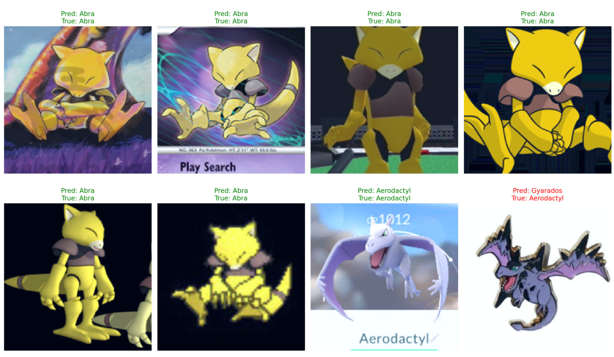
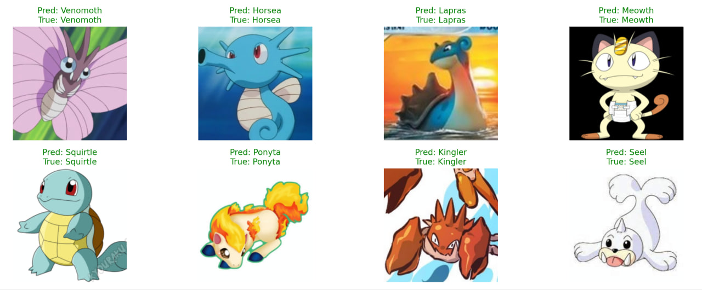

**Pokémon Image Recognition (APS360 Project)**

A CNN-based deep learning system that identifies Pokémon from images across different visual styles — including sprites, anime artwork, and 3D renders.

Built for the APS360: Applied Fundamentals of Deep Learning course, this project demonstrates automated Pokémon recognition, with potential applications in digital Pokédex tools, educational games, and AI-driven content systems.

**Motivation**

The global popularity of Pokémon, with 1,025 distinct species as of 2025 according to the National Pokédex, provides an exciting opportunity to explore fine-grained image classification. Each Pokémon species features unique visual traits, making this a compelling deep learning problem. Traditional image processing methods struggle with the wide variety of Pokémon styles (e.g., pixel sprites, anime, and 3D renders) because they depend on hand-crafted features that do not generalize well. In contrast, Convolutional Neural Networks (CNNs) can automatically learn hierarchical visual representations — such as edges, textures, and color patterns — that remain consistent across these variations.

**Methodology**

This project fine-tunes a pretrained ResNet-18 model using transfer learning, adapting general visual knowledge from ImageNet to the Pokémon domain.

The model is trained on the 7,000 Labeled Pokémon Dataset from Kaggle, which contains images of 150 Pokémon species.

By leveraging transfer learning, the model gains flexibility to recognize Pokémon even when encountering unseen styles or renderings.

**Dataset Attribution**

Dataset: 7,000 Labeled Pokémon Dataset

Author: Lantian773030

License: For educational and research use only.

All Pokémon characters and images are © Nintendo / Game Freak / The Pokémon Company.

**Key Technologies**

PyTorch for model development

ResNet-18 (transfer learning)

Image preprocessing and augmentation

Cross-entropy loss & Adam optimizer

**Potential Applications**

Automated Pokédex tools

Educational games or quizzes

Visual Pokémon encyclopedia or classifier

**Acknowledgements**

This project was developed as part of APS360 – Applied Fundamentals of Deep Learning at the University of Toronto.

Special thanks to Lantian773030 for providing the Pokémon dataset used for model training.

**Dataset Preprocessing**

Dataset: [7,000 Labeled Pokémon Dataset](https://www.kaggle.com/datasets/lantian773030/pokemonclassification/discussion?sort=hotness)

To reproduce the results, download the dataset and place it under a folder named pokemon_dataset/ in the project root. Then, run the split_dataset.py file, this will split the dataset into training, validation and testing dataset with a ratio of 70%, 15%, 15%, and the split dataset can be found in the directory "pokemon_split". 

**Data Loading and Transformation**

The data_loader.py file provides functions for loading and preprocessing the Pokémon dataset.

Training Data Augmentation: Applies transformations such as Random-ResizedCrop, RandomHorizontalFlip, ColorJitter (applied with 0.8 probability), RandomGrayscale, and RandomAffine (small rotations and translations), in addition to resizing and normalization

Data Loading: Functions are available to create PyTorch DataLoader objects for training, validation, and test sets.

Visualization: Includes helper functions to display sample images from the dataset, useful for verifying augmentations and preprocessing steps.

**Baseline Models**

I have trained two different baseline models: a logistic regression classifier and a k-Nearest Neighbors (k-NN) classifier. Both models were trained on flattened pixel values and color histograms extracted from resized Pokémon images (64×64). The logistic regression classifier achieved a validation accuracy of 30.79\%, while the k-NN classifier reached 14.76\%. These results provide a reasonable non-deep-learning baseline for evaluating the performance gains achieved with CNNs. 

To visualize the performance of the baseline models, I computed the confusion matrices for their predictions and plotted the 50 most misclassified classes for each model as heatmaps. In these heatmaps, the diagonal light spots represent correctly classified images, while the off-diagonal cells indicate misclassifications. The heatmaps show that both baseline models struggle to accurately classify Pokémon images, highlighting the need for a more robust classifier in the primary model.

**Primary Model V1**

For my primary classification model (refer to "pokemon_classifier.py"), I adopted transfer learning using the pre-trained ResNet-18 CNN. Input images were resized to 224 x 224 pixels, as recommended for ResNet-18. I replaced the original final layer with a custom two-layer classifier (512 → 256 → 150) featuring ReLU activation and a 0.5 dropout for regularization. All pre-trained feature extractor weights were frozen, so only the new head was trained using Cross-Entropy Loss and the Adam optimizer with weight decay over 30 epochs.

After training, the model achieved a highest 80.68\% training accuracy and 69.42\% validation accuracy at epoch 24, revealing a ~17\% generalization gap. This suggests overfitting despite existing regularization. Moving forward, I plan to tune hyperparameters such as learning rate and dropout strength, and explore additional methods to improve overall performance of the Pokémon classifier. The goal is to progressively raise the validation accuracy toward the 80–85\% range.

**Final Model**
For my final classification model (refer to pokemon_classifier.py), I adopted a transfer learning approach using the pre-trained ResNet-18 CNN. Input images were resized to 224 × 224 pixels, as recommended for ResNet-18. I replaced the original fully connected layer with a custom two-layer classifier (512 → 256 → 150) using ReLU activation and a dropout rate of 0.1 for regularization. After experimenting with several architectures and hyperparameter combinations, this configuration consistently produced the strongest validation performance. In this final setup, I froze the early convolutional layers and trained only the later feature extractor blocks (layer 3 and 4) together with the new classifier head, optimizing using Cross-Entropy Loss and the Adam optimizer with a learning rate of 1 × 10−4, batch size 64, and no weight decay over 30 epochs.

The model demonstrated strong performance throughout training. Over 30 epochs, the classifier reached a final training accuracy of 99.47% and a final validation accuracy of 92.98%. The highest validation accuracy achieved was 93.40% at epoch 22, indicating excellent generalization on unseen Pokémon classes. Figures below show the training loss curve and the training–validation accuracy curves, respectively. The loss decreased steadily across epochs, while the validation accuracy showed consistent improvement before stabilizing near the end of training, suggesting that the model converged well without overfitting.

**Qualitative Result**
Figures below presents sample predictions from the final model on the test set (refer to "qualitative_analysis.py"), all of which were classified correctly, further supporting the high validation and test accuracies reported in the following section.

**Model Evaluation on Test Data**
To assess the performance of the Pokémon classifier on new, unseen data, I evaluated the model on the test set, which contains images that were not used during training or validation.

The model achieved an overall test accuracy of 92.33% (refer to "model_test.py"), demonstrating strong generalization across 150 different Pokémon classes. Additionally, per-class accuracy was calculated to identify how well the model performs on each individual class. Most classes achieved perfect or near-perfect accuracy, with only a few classes such as Kadabra (50%), Pidgeotto (50%),
and Grimer (62.5%) showing lower performance. This analysis highlights that the model performs consistently well across the majority of classes while pinpointing areas where additional data or augmentation may improve accuracy.

Overall, the evaluation on completely unseen test samples indicates that the model’s performance meets expectations for the problem, with robust and consistent accuracy across most Pokémon classes. This demonstrates that the trained model is reliable for classifying new Pokémon images not previously seen during training, within the 150 classes.

**Discussion**
Overall, the model performs very well and is able to consistently distinguish most Pokémon classes. Compared to the baseline logistic regression (30.79%) and k-NN (14.76%) models, the CNN significantly outperforms these simpler approaches, highlighting the power of learned deep features for multi-class image classification. Furthermore, the model effectively distinguishes visually similar
Pokémon, such as those with subtle differences between evolutionary forms. However, a few classes, such as Kadabra and Pidgeotto, were notably harder to classify. This is likely due to a combination of factors: subtle visual differences, relatively fewer representative samples for these classes, or both, indicating that even with an overall sufficient dataset, minority or visually challenging classes remain more difficult for the model.

